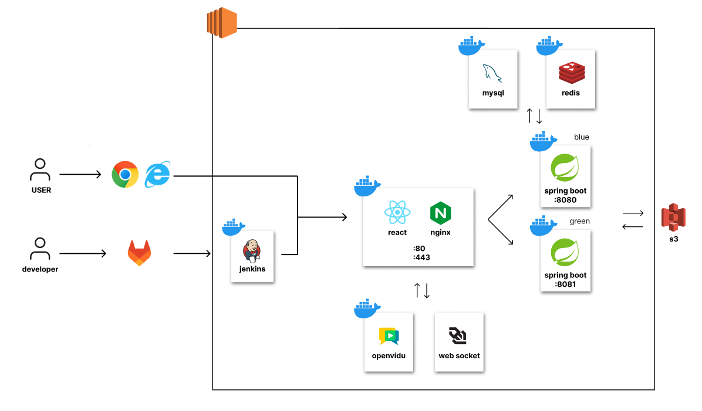
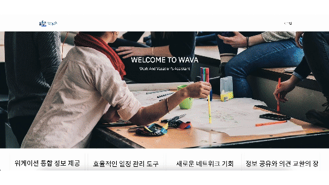
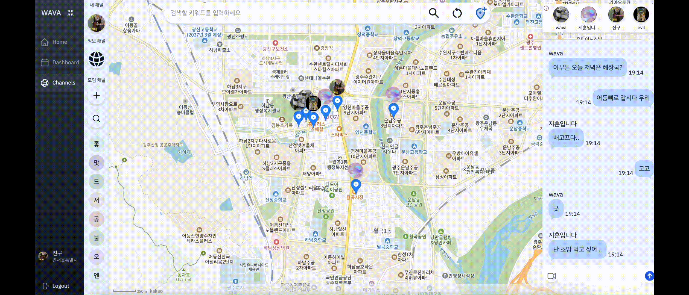

# 💻 WAVA 🏄🏻‍♂️

C204의 역작!

## 개요🌱

###

1. **원격 근무의 증가**: COVID-19 팬데믹 이후 원격 근무가 보편화되면서 워케이션(Work + Vacation)이 새로운 근무 형태로 주목받고 있다. (이는 직원들이 새로운 환경에서 일을 하면서 동시에 휴식을 취할 수 있는 기회를 제공한다.)

2. **일과 휴식의 균형**: 워케이션을 통해 사용자들은 일과 휴식의 균형을 유지할 수 있다. (새로운 환경에서 일하는 것은 업무 집중력과 생산성에 긍정적인 영향을 미친다.)

3. **비용 문제**: 워케이션은 교통비, 숙박비, 식비 등 추가 비용이 발생할 수 있다. 따라서 비용 절감을 위한 솔루션이 필요하다.

4. **사용자 경험**: 사용자들은 쉽고 편리하게 워케이션 장소를 검색하고 예약할 수 있는 플랫폼을 필요로 한다.(직관적이고 사용자 친화적인 인터페이스가 중요하다.)

5. **지속 가능성**: 워케이션은 일시적인 트렌드가 아니라 지속적으로 성장할 가능성이 높은 분야이다. (이를 통해 안정적인 수익원과 지속 가능한 비즈니스 모델을 구축할 수 있다.)

## UCC

## WAVA 팀원 소개

| **전지훈(팀장) [FE]**                                          | **김민주** [FE]                                                                      | **한세훈** [FE]                                                       |
| -------------------------------------------------------------- | ------------------------------------------------------------------------------------ | --------------------------------------------------------------------- |
|  |                         |         |
| 팀장   디자인                                            | AI   Notion 정리   커서 공유   공유 마커                                    | 프론트 리더   프론트 스켈레톤 설계   기능 구현   답변 전문가 |
| **안진우 [BE]**                                                | **이병수 [BE]**                                                                      | **최승호 [BE]**                                                       |
|   |                         |         |
| 채팅 구현   공유 마커   DB 설계   jwt 로그인          |   UCC 제작   무중단 배포   채널 crud   test 코드 작성   openvidu 세팅 | api 설계 및 구현  피드 채널   정보 채널   발표 및 ppt 제작   |

## 프로젝트 기간💞️

### 진행기간

- 2024년 07월 00일 ~ 2024년 08월 16일(6주)

## 개발 환경 👀

    <h1>📚 기술 스택 & 버전 정보</h1>

### Common

1. 이슈 관리: 
2. 형상 관리: 
3. 커뮤니케이션:    

### BackEnd

  

- IntelliJ : 2024.1.4
- SpringBoot: 3.3.2
  - Project Metadata
    - Group: com.ssafy
    - Artifact: worcation
    - Name: worcation
    - Package Name: com.wava.woraction
- JDK : openjdk 17.0.10 2024-01-16 LTS
- MySQL: mysql Ver 9.0.1
- Spring Data JPA: 3.3.2
- Spring Security: 3.3.2
- Redis: 3.3.2
- JWT: 0.11.5
- S3: 1.12.261
- OpenVidu: 2.30
- AOP: 3.3.2
- JUnit: 5

### FrontEnd

- Visual Studio Code: 1.91.1
- Node.JS: 20.12.2
- npm: 10.5.0
- WebPack
- REACT: 18.3.1
- Zustand: 4.5.4
- TailwindCSS: 3.4.8
- Figma
- OpenVidu: 2.30
- DaisyUI: 4.12.10

### CI/CD

- GitLab: 17.0.5
- Jenkins: **2.470**
- Nginx: 1.27.0
- Docker: 27.1.1

### WAS

- EC2: ubuntu
- CertBot: 0.40.0

## ERD 🌐

## 아키텍쳐♟️

## WAVA 주요 기능

### 1. 통합 워케이션 정보 제공

- 흩어져 있는 워케이션 공고들을 한 곳에서 확인할 수 있는 기능

### 2. AI 조수 리마인더

- 사용자가 기록한 일정에 따라 AI 비서가 개인화된 팁과 리마인더 제공 및 알림

### 3. 일정 관리 달력

- 일정을 손쉽게 등록 및 수정할 수 있는 기능

### 4. 소셜 미디어 기능

- 사용자가 워케이션 경험이나 일상 생활에 대한 기록을 남기고 공유할 수 있는 소셜 미디어 기능

### 5. 네트워킹 및 커뮤니티 기능

- 같은 지역에서 워케이션을 하는 사용자들끼리 그룹을 형성하여 네트워킹 기회제공 기능

### 6. 공유 지도

- 그룹 내에서 공유지도를 통해 활동 계획을 세우고, 무엇을 할지, 무엇을 먹을지, 어디서 일을 할지를 결정할 수 있는 기능(WebSocket 활용)

### 7. 실시간 커뮤니케이션

- WebRTC 기반의 화상 통화와 WebSocket, STOMP 기반의 실시간 채팅 기능

## WAVA 서비스 화면 🕸️

### 0. 와이어프레임

https://www.figma.com/design/4VeKdIA1s5z5f5RznnS6yE/C204_WireFrame?node-id=15-128&t=TVHSwUypf1rZqse5-0

### 1. 메인페이지

✔️ 메인 페이지 기능/모바일

​ ✔️ 진행중인 워케이션

​ ✔️ 워케이션 효과 및 경제적 파급효과

### 2. 회원가입 및 로그인

​ ✔️ 회원 가입 및 로그인 기능 /모바일

​ ✔️ 지역 선택

### 3. 대시보드

​ ✔️ 대시보드 기능/모바일

​ ✔️ 일정 관리

​ ✔️ AI 일정 리마인드

### 4. 내 채널

​ ✔️ 내 채널 기능/모바일

​ ✔️ 피드 작성/삭제

​ ✔️ 프로필 사진 변경

### 5. 정보 채널

​ ✔️ 정보 채널 기능/모바일

​ ✔️ 다양한 피드 보기/작성/삭제

### 6. 모임 채널

​ ✔️ 모임 채널 기능/모바일

​ ✔️ 모임 채널 생성/삭제

​ ✔️ 모임 채널 보기

### 7. 모임채널 - 공유지도

​ ✔️ 공유 지도 기능/모바일

​ ✔️ 공유 지도 검색

### 8. 모임 채널 - 채팅 및 영상 통화

​ ✔️ 기능/모바일

​ ✔️ 채팅 및 영상 통화

